# Practica 5 - Serverless con OpenFaaS


## Indice

* [1-Setup Student AWS](#1-Setup-Student-AWS)
* [2-Consola / US East / Ver VPC](#2-Consola)
* [3-Crear Instancia](#3-Crear-Instancia)
* [4-Bajar Credenciales](#4-Bajar-Credenciales)
* [5-Conectarse a la Instancia](#5-Conectarse-a-la-Instancia)
* [6-Instalar Docker](#6--Instalar-Docker)
* [7-Instalar la images/Imagen de Frontned](#7--Instalar-la-images/Imagen-de-Frontned)
* [8-Exponer Open FaaS via Security Group](#8--Exponer-Open-FaaS-via-Security-Group)
* [9-Desplegar una Fuction de prueba](#9--Desplegar-una-Fuction-de-prueba)

## 1-Setup Student AWS
https://www.awseducate.com/Registration?token=df86d904630595c577b383763253c42d#INFO-Student

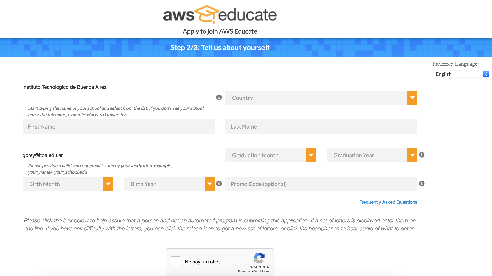

## 2-Consola
https://console.aws.amazon.com/ec2/home?region=us-east-1#Home:

## 3-Crear Instancia
https://us-east-2.console.aws.amazon.com/ec2/v2/home?region=us-east-2#Instances:sort=instanceId

### 1- Launch Instance

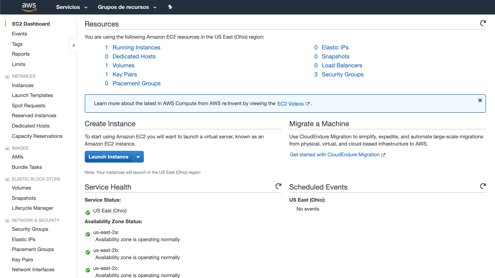

### 2- Seleccionar "Amazon Linux 2 AMI (HVM), SSD Volume Type"

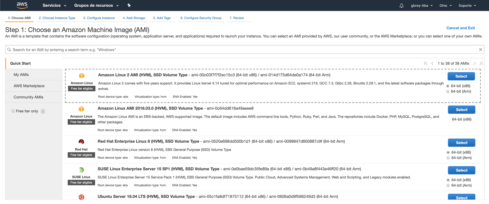

### 3- Seleccionar "t2.micro"

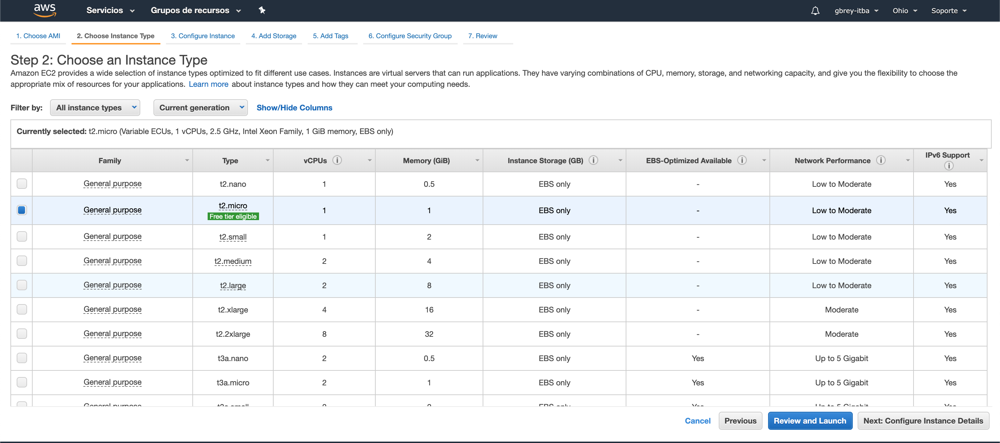

### 3-Review and Launch 2 veces y Launch

## 4-Bajar Credenciales
Definir un nombre del certificado "itba"
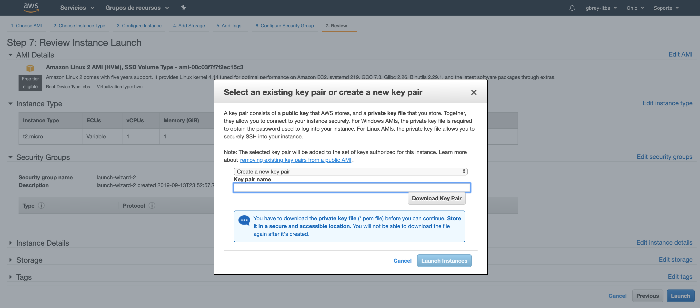

## Bajar Putty y PuttyGen (ambos 64bits)

https://www.chiark.greenend.org.uk/~sgtatham/putty/latest.html

## 5-Conectarse a la Instancia

Obtener la dirección de la isntancia:
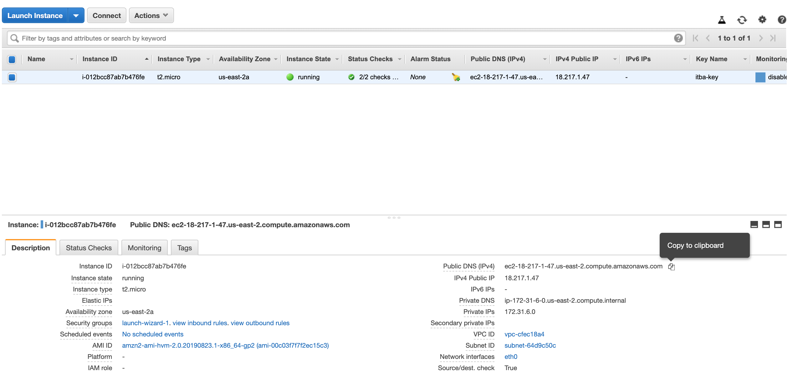

Conectarse a la instancia desde el Putty (https://docs.aws.amazon.com/es_es/AWSEC2/latest/UserGuide/putty.html)

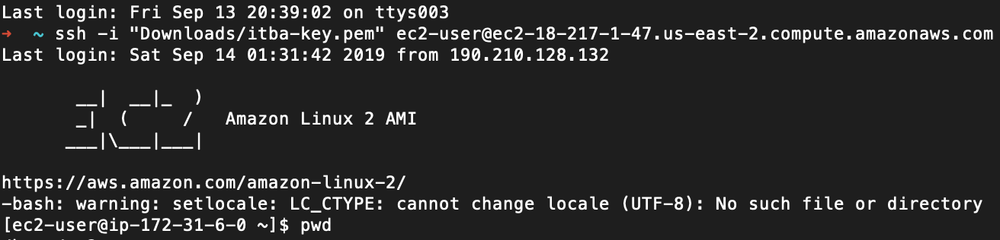

### Troubleshooting
* Recordar incluir "ec2-user@" antes del nombre de la instancia
* Importar el ppk generado el puttygen

## 6- Instalar Docker

Ejecutar el siguiente comando
```
sudo yum install docker
```
Escribir "y" cuando pregunta
Revisar si Docker está instalado
```
sudo service docker start
```
Revisar si Docker está instalado
```
sudo docker version
```
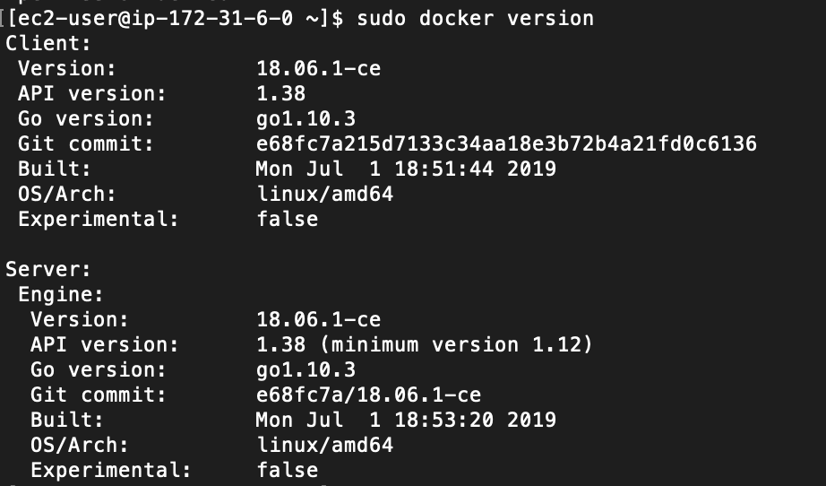
## 7- Instalar OpenFaaS
Ejecutar el siguiente comando
```
sudo yum install git

```
### Installar Open FaaS
Ejecutar el siguiente comando
```
git clone https://github.com/openfaas/faas

```

### Iniciar Swarm
Ejecutar el siguiente comando
```
sudo docker swarm init
```

### Lanzar OpenFaaS
Ejecutar el siguiente comando
```
cd faas
sudo ./deploy_stack.sh --no-auth
```
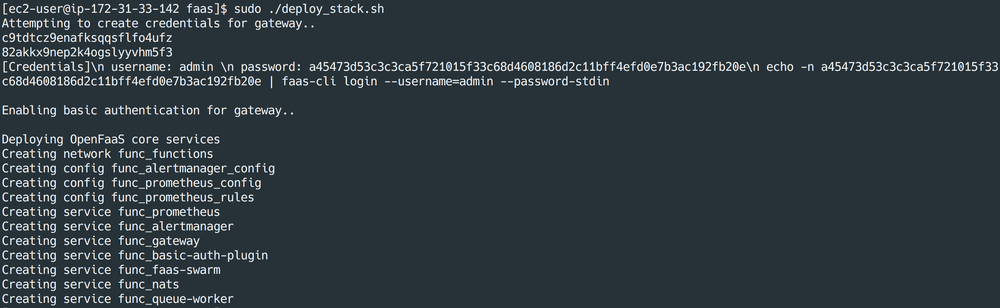

## 8- Exponer Open FaaS via Security Group
### Crear nueva regla
Navegar a Network Security->Security Group
Seleccionar "launch-wizard-1"
Seleccionar Solapa "Inbound"
Agregar un puerto 8080
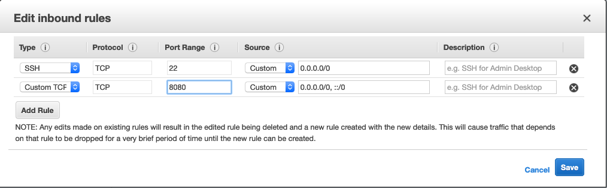

### Probar la consola de Open FaaS
Obtener la dirección pública de la máquina y llamar desde el browser al puerto 8080 [ip:8080]
Llamarla desde el Browser
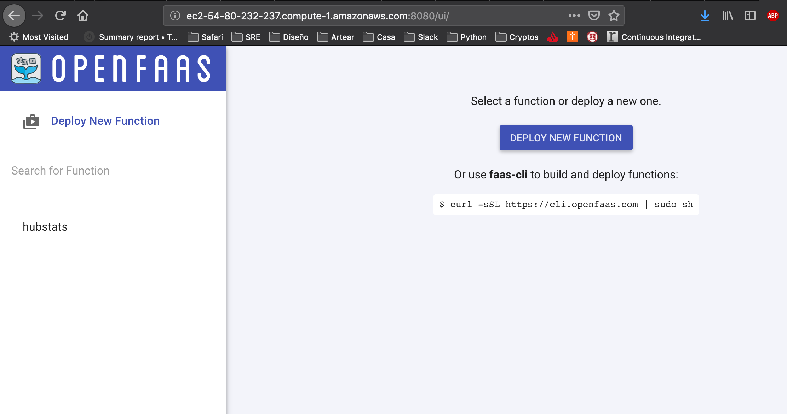

## 9- Desplegar una Fuction de prueba
Click en el boton de "Deploy New Function"

Elegir del Store, "Figlet" y clicker en "DEPLOY"
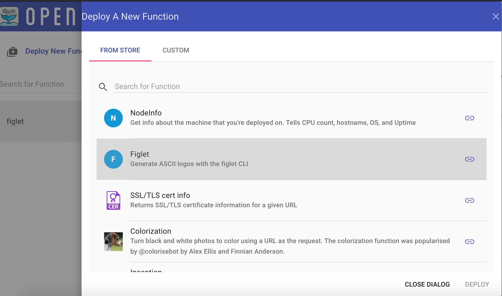

Cambiar el "Request Body" y botón "INVOKE"
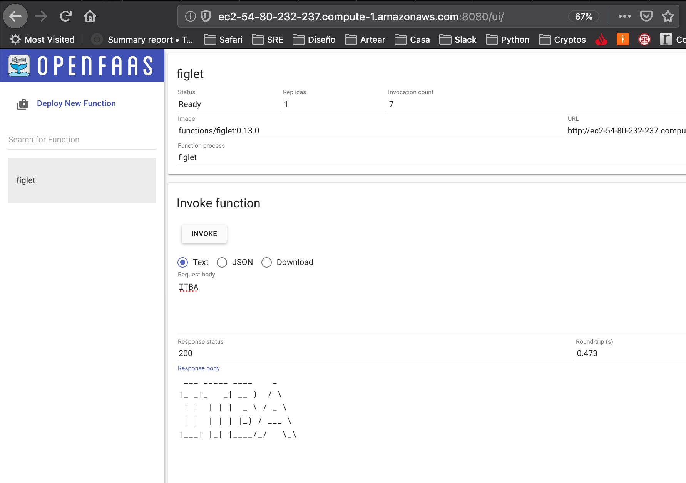

## 10- Escribir una funcion propia

### Instalar el cliente de Open FaaS
```
curl -sSL https://cli.openfaas.com | sudo sh
```
### Crear una funcion propia
Ejecutar el siguiente comando 
```
$ mkdir -p ~/functions && \
  cd ~/functions
```
### Crear el proyecto
Ejecutar el siguiente comando
```
faas-cli new --lang python hello-python
```
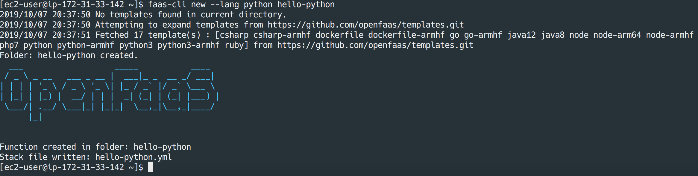

### Cambiar el codigo de la Function
Ejecutar el siguiente comando
```
cd hello-python
```
Ejecutar el siguiente comando
```
echo "def handle(req):
    print("Hello! You said: " + req)" > handler.py
```
Ejecutar el siguiente comando para Buildear
```
cd ..
sudo /usr/local/bin/faas-cli build -f ./hello-python.yml
```
Ejecutar el siguiente comando para desplegar
```
sudo /usr/local/bin/faas-cli deploy -f ./hello-python.yml
```